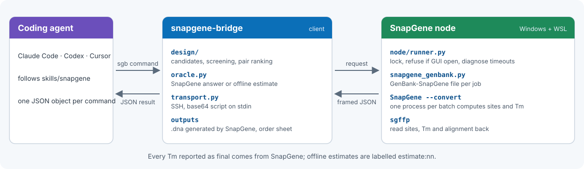

<p align="center">
  
</p>

<p align="center">
  
  
  
  
  
  
</p>

<p align="center">
  English | <a href="READMEs/README.zh-CN.md">简体中文</a>
</p>

An agent-native bridge for **primer design on top of SnapGene**. Coding agents design PCR and cloning primers locally, while SnapGene itself, driven through its official command line, computes every binding site and melting temperature. SnapGene can run on the same machine or on a lab PC reached over SSH.

### Why SnapGene Bridge?

**1. SnapGene's own numbers.** There is no second Tm standard to reconcile.
- Binding sites, Tm and alignment details come straight from SnapGene's importer and match the GUI exactly.
- Mismatched, bulged and off-target sites are reported the way SnapGene sees them.
- Results are regression-pinned: `selftest` checks 208 primers against recorded SnapGene 8.0.0 output.

**2. A remote SnapGene node.** SnapGene stays on the lab PC that holds the licence.
- One SnapGene process handles a whole batch: 1,000 primers take about 5 s.
- Works with Windows OpenSSH and WSL out of the box. Requests travel on stdin and responses come back as framed JSON.
- Refuses to run while the GUI is open, reports hidden dialogs, and cleans up after itself.

**3. Built for coding agents** such as Claude Code, Codex and Cursor.
- Every command prints one JSON object, with stable error codes and recovery hints.
- Ships an agent skill (`skills/snapgene/`), so the agent knows the workflow immediately.
- Writes `.dna` files generated by SnapGene, plus oligo order sheets, for human review.

> **If you are an AI agent**, read [`AGENTS.md`](AGENTS.md) and [`skills/snapgene/SKILL.md`](skills/snapgene/SKILL.md) first.

## Choose your workflow

| You want to... | Command | Needs |
|---|---|---|
| Get SnapGene's Tm and binding sites for existing primers | `sgb check` | SnapGene node |
| Subclone an insert with restriction-site or overlap tails | `sgb clone` | SnapGene node |
| Amplify a region for screening or diagnostic PCR | `sgb pcr` | SnapGene node |
| Try the tool without SnapGene | add `--offline` | Nothing; values are local estimates labelled `estimate:nn` |
| Run SnapGene on another computer | `sgb init --host` then `sgb deploy` | SSH key login and SnapGene installed |

## Quick Start

```bash
# 0. Get the source
git clone https://github.com/Ryuwang3/snapgene-bridge.git
cd snapgene-bridge

# 1. Install the CLI (provides `snapgene-bridge` and the short alias `sgb`)
uv tool install --editable .

# 2. Point it at the SnapGene node (an alias from ~/.ssh/config)
sgb init --host my-node

# 3. Install the node side and verify it
sgb deploy
sgb status             # look for "ready": true
sgb selftest --quick   # compares the node with recorded SnapGene 8.0.0 results
```

Before the first run, open SnapGene once on the node. Complete the first-launch dialog and licence activation, then close it, because the command line blocks on any dialog. See [Node setup](docs/node-setup.md).

### Example: subclone AmpR from pUC19

```bash
sgb clone tests/data/pUC19_L09137.gb --region 1626..2486 --strand - \
    --tail-f GCGCTAGC --tail-r GCCTCGAG --name bla \
    --output bla.dna --order bla_order.tsv
```

| Primer | Sequence (5'→3') | SnapGene Tm |
|---|---|---|
| `bla_F26` | `GCGCTAGCATGAGTATTCAACATTTCCGTGTCGC` | 60 °C |
| `bla_R24` | `GCCTCGAGTTACCAATGCTTAATCAGTGAGGC` | 60 °C |

- SnapGene evaluated all 42 candidate lengths in one batch, in 4.7 s.
- `bla.dna` is written by SnapGene itself, so opening it shows the same numbers.
- For `bla_R24`, SnapGene counts 26 annealed bases, because two tail bases happen to pair with the template. A re-implemented Tm model would miss this.

## CLI reference

Every command accepts `--help`. Locations use SnapGene's 1-based inclusive `a..b` notation. Circular regions may wrap the origin, for example `2600..120`.

| Command | What it does |
|---|---|
| **Node** | |
| `init --host HOST` | Write `~/.config/snapgene-bridge/config.toml` |
| `deploy` | Build a wheel and install it on the node, in `~/snapgene-bridge-node` |
| `status` | Report local dependencies, node health and version skew; `ready` is true when everything is usable |
| `selftest [--quick]` | Re-run 208 primers and compare them with recorded SnapGene 8.0.0 output |
| **Analysis** | |
| `check FILE --primer NAME=SEQ` | Report SnapGene binding sites, Tm, alignment components and off-targets |
| **Design** | |
| `clone FILE --region a..b` or `--feature NAME` | Primers fixed at the insert ends, with optional 5' tails; lengths chosen by SnapGene Tm |
| `pcr FILE --target a..b` or `--feature NAME` | Flanking pairs proposed by primer3 and re-ranked by SnapGene |
| **Files** | |
| `read FILE`, `validate FILE` | Parse `.dna`, GenBank or FASTA into normalized JSON |
| `open FILE` | Open a file in a local desktop app |

Design options:

| Option | Default | Meaning |
|---|---|---|
| `--target-tm` | 60 | Target SnapGene Tm |
| `--max-dtm` | 2 | Largest Tm difference allowed within a pair |
| `--length MIN-MAX` | 16-36 for `clone`, 18-28 for `pcr` | Annealing length range |
| `--offtarget-max-tm` | 45 | Reject a candidate if any other site reaches this Tm |
| `--output NEW.dna` or `NEW.gb` | none | Write the template with the chosen primers |
| `--order NEW.tsv` | none | Write a tab-separated oligo order sheet |
| `--offline` | off | Use local estimates instead of SnapGene |

## Exposing the skill to your coding agent

```bash
mkdir -p ~/.claude/skills
ln -s "$(pwd)/skills/snapgene" ~/.claude/skills/snapgene-bridge
```

Codex and other agents read [`AGENTS.md`](AGENTS.md). If an agent supports a skill directory, point it at `skills/`.

## Architecture

<p align="center">
  
</p>

- **Design** (`design/`) builds candidates, screens them and ranks pairs. For `clone` it tries every annealing length at the fixed insert ends; for `pcr` it uses primer3 proposals, with salt settings close to SnapGene's.
- **Oracle** (`oracle.py`) has two implementations. `SnapGeneOracle` asks the node. `EstimateOracle` is the offline fallback: an exact 3'-anchored search plus a nearest-neighbour estimate.
- **Transport** (`transport.py`) sends a base64 request inside a POSIX script on SSH stdin. The response is framed JSON, so login banners or a trailing `logout` cannot corrupt it.
- **Node** (`node/`) takes a lock and refuses to run while SnapGene is open. It then writes GenBank-SnapGene files, runs `SnapGene --convert` once per batch, and parses each `.dna` with [sgffp](https://github.com/merv1n34k/sgffp).

> **How SnapGene does the math.** SnapGene imports `primer_bind` features as primers, and computes their sites and Tm, only when the GenBank file carries its own `JOURNAL   Exported … from SnapGene` line. See [`snapgene_genbank.py`](src/snapgene_bridge/snapgene_genbank.py) and [ADR 0002](docs/decisions/0002-snapgene-cli-oracle.md).

## Benchmarks

SnapGene 8.0.0 on Windows 11 with WSL2; client on macOS.

| Measurement | Result |
|---|---|
| 1,000 primers in one batch | 4.8 s, mostly SnapGene start-up |
| 20 files with 50 primers each | 6.7 s |
| `selftest` on 208 primers | All sites and Tm values identical |
| `clone` of pUC19 AmpR, end to end | About 17 s, including `.dna` output |
| Textbook nearest-neighbour model compared with SnapGene | Same integer on 61 % of 2,162 sites; mean error 0.51 °C |

## Comparison

| | snapgene-bridge | SnapGene GUI | primer3-based scripts | Hosted cloning MCP services |
|---|---|---|---|---|
| Tm identical to SnapGene | ✅ | ✅ | ❌ different model | ❌ different model |
| Callable by coding agents | ✅ CLI, JSON and skill | ❌ | ✅ | ✅ |
| Sequences stay on your machines | ✅ | ✅ | ✅ | ❌ uploaded |
| Writes SnapGene `.dna` | ✅ generated by SnapGene | ✅ | ❌ | ❌ read only, as of 2026-10 |
| Batch evaluation | ✅ about 1,000 primers in 5 s | ❌ manual | ✅ | ✅ |

## Limitations

- The SnapGene GUI must be closed on the node while commands run; otherwise the command fails with `snapgene_busy`.
- Any modal dialog blocks the command line. On timeout the bridge returns `snapgene_timeout` together with the dialog text.
- SnapGene reports an integer Tm for the annealed bases only, without 5' tails, at 50 mM Na+ and no Mg2+. For Phusion or Q5, SnapGene suggests annealing 6–12 °C above its Tm.
- The `JOURNAL` trigger is observed behaviour of SnapGene 8.0.0, not a documented API. Run `selftest` after every SnapGene upgrade.
- Only the Windows + WSL node is verified. The macOS and Linux backends are untested.
- Check your SnapGene licence: computer-specific licences forbid remote access.

## Documentation

- [Node setup and troubleshooting](docs/node-setup.md) (Chinese)
- [Architecture](docs/architecture.md), [JSON contract](docs/json-contract.md), [Decision records](docs/decisions), [Roadmap](docs/roadmap.md)
- [Verified SnapGene behaviour](docs/research/snapgene-platform.md)

## Development

```bash
uv run --group dev python -m pytest            # unit tests, no SnapGene needed
uv run --group dev python -m pytest -m node    # end-to-end against the configured node
uv run --group dev ruff check src tests
```

## Acknowledgements

- [sgffp](https://github.com/merv1n34k/sgffp) for reading SnapGene `.dna` files.
- [primer3-py](https://github.com/libnano/primer3-py) and [Biopython](https://biopython.org) for candidate generation and local estimates.
- [virtuoso-bridge-lite](https://github.com/Arcadia-1/virtuoso-bridge-lite) for the agent-bridge pattern this project follows.

## License

Apache-2.0. SnapGene is a trademark of its owner. This project is not affiliated with or endorsed by the makers of SnapGene.
